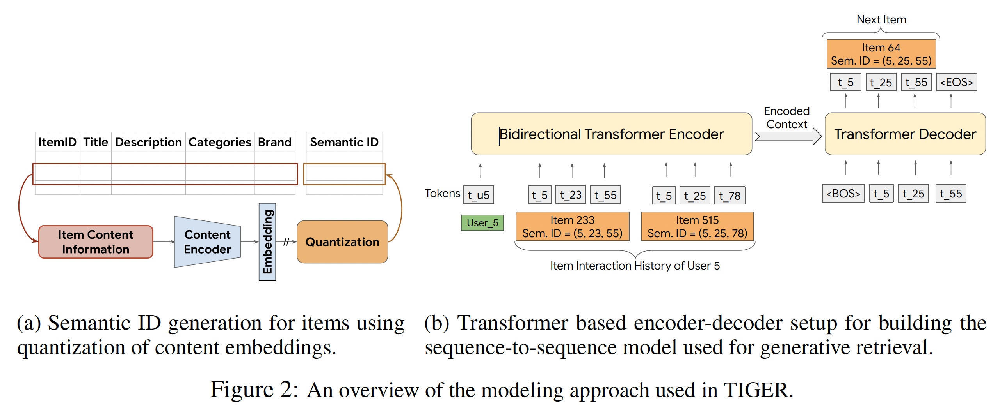

# Generative Sequential Recommendation via Semantic IDs

A from-scratch implementation of generative sequential recommendation on Amazon Beauty.
Each item is represented by a short, hierarchical Semantic ID learned by a Residual-Quantized VAE
over text embeddings, and a small T5 encoder-decoder predicts the next item by autoregressively
generating the four tokens of its Semantic ID.

The design follows the generative-retrieval recipe of Rajput et al., *Recommender Systems with
Generative Retrieval* (NeurIPS 2023). This repository is an independent implementation written
to (a) verify whether semantic structure actually adds value on top of an autoregressive backbone
and (b) explore a few targeted improvements over the original recipe.

## Results

All-rank Recall@K / NDCG@K on Amazon Beauty (5-core, leave-one-out split, no negative sampling).

| Model | R@5 | N@5 | R@10 | N@10 |
|---|---|---|---|---|
| Random ID baseline (4-token random ids, same T5)               | 0.0258 | 0.0174 | 0.0394 | 0.0218 |
| SASRec (this repo)                                              | 0.0358 | 0.0180 | 0.0573 | 0.0250 |
| **Semantic ID + T5 (this repo)**                                | **0.0384** | **0.0256** | **0.0604** | **0.0326** |
| Original paper (reference)                                      | 0.0454 | 0.0321 | 0.0648 | 0.0384 |

Headline numbers for the Semantic-ID generative model:

- **+30 % NDCG@10 over our SASRec baseline** — generative ranking is the main source of NDCG gain.
- **+50 % NDCG@10 over a same-architecture random-ID baseline** — isolates the contribution of *semantic* structure on top of the autoregressive backbone, which is itself non-trivially strong (random-ID R@10 = 0.0394, well above any popularity baseline).
- The remaining gap to the original paper's reported numbers (-7 % R@10) is comparable to the gap between our random-ID baseline and the paper's random baseline (~9 %), suggesting most of the residual difference is split / sampling noise rather than recipe.

## Architecture

<p align="center">
  
  <br/>
  <sub>Figure 2 from Rajput et al., <em>Recommender Systems with Generative Retrieval</em> (NeurIPS 2023) — the two-stage recipe (RQ-VAE Semantic IDs + seq2seq generative decoding) this repository implements.</sub>
</p>

This repo's concrete pipeline:

```
text metadata
   │
   ▼
Ollama nomic-embed-text  ──►  item_embeddings_raw.npy  (12,101 × 768)
   │
   ▼
RQ-VAE   (3 codebooks × 256 + collision code, 32-d latent)
   │
   ▼
Semantic IDs   (item → (c0, c1, c2, c3))
   │
   ▼
T5 encoder-decoder, trained from scratch (~4.6 M params)
   │   encoder input  : flattened history of Semantic ID tokens
   │   decoder output : 4 Semantic ID tokens of the next item
   ▼
Constrained beam search   →   top-K item recommendations
```

Pipeline scripts:

| Step | Script | Output |
|---|---|---|
| 1. Build dataset       | `data/data_process.py`             | `data/beauty_data.pkl` |
| 2. Item embeddings     | `embedding/extract_embeddings.py`  | `embedding/item_embeddings_raw.npy` |
| 3. Train RQ-VAE        | `embedding/rqvae.py`               | `checkpoints/rqvae_best.pt` |
| 4. Generate Semantic IDs | `embedding/generate_rqvae_ids.py` | `embedding/semantic_ids_rqvae.npy` |
| 5. Train T5            | `train.py`                         | `checkpoints/best_model_t5.pt` |
| 6. Evaluate            | `evaluate.py`                      | Recall@K / NDCG@K printout |
| (baseline) SASRec      | `baseline/sasrec_train.py`         | `checkpoints/sasrec_best.pt` + metrics |

## Dataset

Amazon Beauty 5-core ([SNAP](http://snap.stanford.edu/data/amazon/)).

| Stat | Value |
|---|---|
| Users | 22,363 |
| Items | 12,101 |
| Interactions | 198,502 |
| Split | leave-one-out |
| Evaluation | all-rank Recall@K / NDCG@K |

## Quickstart

```bash
pip install -r requirements.txt

# Step 2 needs an Ollama install + the nomic-embed-text model
brew install ollama && ollama pull nomic-embed-text

python data/data_process.py
python embedding/extract_embeddings.py
python embedding/rqvae.py
python embedding/generate_rqvae_ids.py
python train.py
python evaluate.py

# Independent baseline
python baseline/sasrec_train.py
```

A single Colab notebook (`notebooks/colab_full_pipeline.ipynb`) runs the entire pipeline end-to-end on a fresh GPU runtime.

## Modifications relative to the original recipe

- **Local item embeddings via Ollama `nomic-embed-text`** instead of pretrained Sentence-T5 — drops the dependency on a hosted service and gives ~100 % codebook usage (vs ~38 % observed when we tried sentence-T5).
- **6-field item prompt** — `title / brand / category / description[:1000] / price bucket / popularity bucket` — with HTML-entity cleanup and per-field skipping (no `unknown` placeholders), instead of an unstructured concatenation.
- **Final-epoch RQ-VAE checkpoint** — selecting by codebook collision rate is unsafe for this dataset because the lazy k-means initialisation at epoch 1 reaches a higher unique-rate than any trained epoch while encoding noise. This bug nearly collapses downstream performance to the random-ID baseline; saving the final epoch fixes it.
- **All-rank validation, not 99-negative validation** — the 99-negative protocol unfairly favours discriminative models when beam search misses; using the same all-rank protocol for both validation and test cuts our val/test gap from −50 % to −34 %.
- **Constrained beam search with no Hamming fallback** — invalid beams are dropped instead of being projected back to the nearest valid item; the model is held to the same standard as the evaluation.

## References

- Rajput et al., *Recommender Systems with Generative Retrieval*, NeurIPS 2023. [arXiv:2305.05065](https://arxiv.org/abs/2305.05065)
- Kang & McAuley, *Self-Attentive Sequential Recommendation*, ICDM 2018. [arXiv:1808.09781](https://arxiv.org/abs/1808.09781)
